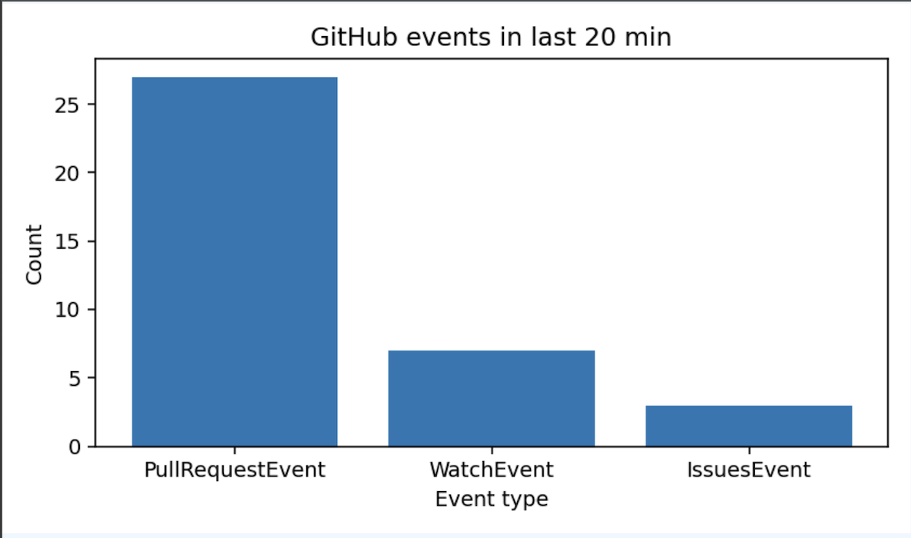

# Welcome to GitHub Monitoring API project
*Prepared by Maros Jevocin*

## Introduction
The aim of this project was to prepare an API solution which would stream public events from [GitHub REST API events endpoint](https://docs.github.com/en/rest/activity/events?apiVersion=2022-11-28).

Event types we are interested in are WatchEvent, PullRequestEvent and IssuesEvent.

Using http requests, a user should be able to access metrics about streamed public GitHub events and visual representation of one of the metrics.

Below is a c4 model system context diagram of a proposed solution:


## How to run
You will need environment with python version 3.12.

It is recommended to use virtual environments to not change your system python.
<br/>If you have never created a python virtual environment, you can try for example [Anaconda](https://www.anaconda.com/download)  or more light-weight variation [Miniconda](https://www.anaconda.com/docs/getting-started/miniconda/main).

Once Anaconda or miniconda is installed, open terminal.

To create a new environment, enter:
```commandline
conda create -n github_monitor312 python=3.12
```
feel free to change *github_monitor312* to any environment name you would prefer.

Once the environment is created, to activate the new environment, enter:
```commandline
conda activate github_monitor312
```

Change directory to be in same path as the project folder is, e.g. in MacOS */Users/<user_name>/PycharmProjects/github-monitoring-api*, where <user_name> is to be replaced with your OS user.
```commandline
cd /Users/<user_name>/PycharmProjects/github-monitoring-api
```

To install dependencies, run:
```commandline
pip install -r requirements.txt
```

NOTE:
<br/>For the demo purposes, some events have been added manually for better experience during the average metric testing. You can change this by changing `LOAD_AVG_METRICS_TESTING_EVENTS` boolean in *api/config.py*.

Once the dependencies are installed, you are ready to run the API.
```commandline
python3 -m api.main
```

The API should start running locally on your machine.
You should see logs like this:
```commandline
INFO:     Started server process [99902]
INFO:     Waiting for application startup.
INFO:     Application startup complete.
INFO:     Uvicorn running on http://0.0.0.0:8080 (Press CTRL+C to quit)
```
where you can click on *http://0.0.0.0:8080* to open it in browser.

From here you can visit *http://0.0.0.0:8080/docs* for a swagger interface to explore available API endpoints.

## Metrics
### Average interval between PullRequestEvent events for a provided repository

Endpoint: `/metrics/avg-pr-interval`

Formula:
```math
\overline{\Delta t} = \frac{1}{n-1} \sum_{i=1}^{n-1} \left(t_{i+1} - t_i\right)
```
where in our case $t_i$ is `created_at` datetime property of $i$-th PullRequestEvent event and $n$ is number of PullRequestEvent for a provided repository.

NOTE:
<br/>Feel free to use the `/meta/repos` endpoint to explore available repositories. The endpoint allows you to define a threshold of minimum counts of PullRequestEvent per repository with minimum count 2.

### Total number of events grouped by the event type for a given offset

Endpoint: `/metrics/counts`

Visualization endpoint: `/viz/counts.png`

Example graph:


## Possible future improvements
- Adding a support to provide a personal GitHub access token. This could increase rate limit for GitHub events API endpoint from 60 to 5000 and allow a more detailed monitoring.
- Scanning of the EventStore instance is linear at the moment. This could be improved by a more optimized search, since a deque is adding events in a chronological order